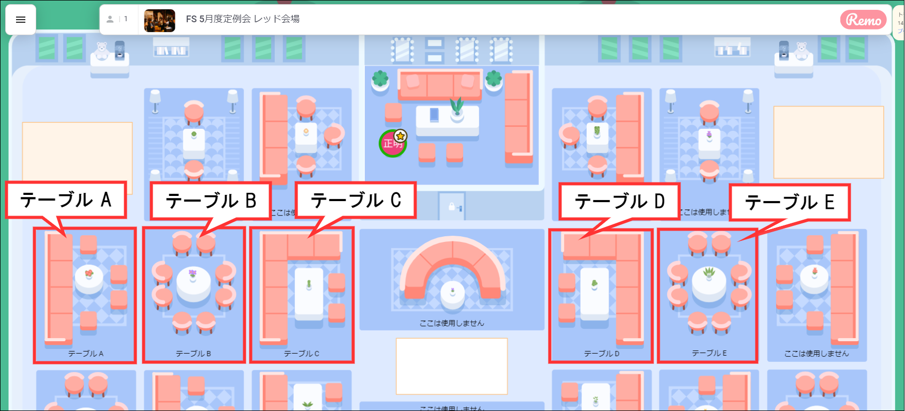
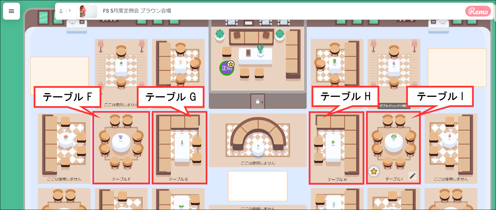

#  2021年5月度定例会 

### 開催日時

5/14(金) 19:30 ～   

今回の定例会のテーマは、 **「あなたの価値観を明確にして、今後の仕事や人生で後悔のない選択ができるようにしよう」** です。

5月度定例会 Teams:  
https://teams.microsoft.com/l/meetup-join/19%3a4783ed85d7ff4ce28c90f29e2e16033d%40thread.tacv2/1617778129922?context=%7b%22Tid%22%3a%227e19d899-8805-4c1b-8e0e-00fe710963e4%22%2c%22Oid%22%3a%2247665828-a717-478d-a455-bd3a3dbfaaf2%22%7d

## ⬛ 🕢 タイムテーブル

<table>
  <tr>
    <td>時刻</td>
    <td>所要時間</td>
    <td colspan="2">内容</td>
    <td>担当</td>
    <td>概要</td>
  </tr>
  <tr>
    <td>19:30 ～ 19:35</td>
    <td>05分</td>
    <td colspan="2">スタート</td>
    <td>今立さん</td>
    <td>あいさつ、前回の振り返り</td>
  </tr>
  <tr>
    <td>19:35 ～ 19:40</td>
    <td>05分</td>
    <td colspan="2">① レクリエーションの告知</td>
    <td>橋本さん</td>
    <td>マーダーミステリーで犯人を見つけろ！</td>
  </tr>
  <tr>
    <td>19:40 ～ 19:50</td>
    <td>10分</td>
    <td colspan="2">② jinjer についての説明</td>
    <td>斧田さん</td>
    <td>jinjer 打刻方法・ルールについての説明</td>
  </tr>
  <tr>
    <td>19:50 ～ 20:05</td>
    <td>15分</td>
    <td colspan="2">③ Good eラーニング賞など</td>
    <td>橋本さん</td>
    <td>今月は誰かな？</td>
  </tr>
  <tr>
    <td>20:05 ～ 20:20</td>
    <td>15分</td>
    <td colspan="2">④ 先輩インタビュー</td>
    <td>今立さん</td>
    <td>受託部 安田直人さんへのインタビュー</td>
  </tr>
  <tr>
    <td>20:20 ～ 20:30</td>
    <td>10分</td>
    <td rowspan="5">⑤ ワークショップ（価値観を明確にしよう）</td>
    <td>ワーク説明</td>
    <td>近藤さん</td>
    <td>動画を使ってワーク内容・方法を説明</td>
  </tr>
  <tr>
    <td>20:30 ～ 20:40</td>
    <td>10分</td>
    <td rowspan="4">ワーク実施</td>
    <td rowspan="4">各自</td>
    <td>価値観 100 リストから 20 個を選ぶ</td>
  </tr>
  <tr>
    <td>20:40 ～ 20:50</td>
    <td>10分</td>
    <td>価値観 20 個から 10 個に絞る</td>
  </tr>
  <tr>
    <td>20:50 ～ 21:00</td>
    <td>10分</td>
    <td>価値観 10 個から 5 個に絞る</td>
  </tr>
  <tr>
    <td>21:00 ～ 21:05</td>
    <td>05分</td>
    <td>ワークの感想記載</td>
  </tr>
  <tr>
    <td>21:05 ～ 21:10</td>
    <td>05分</td>
    <td colspan="2">定例会の感想記載</td>
    <td>各自</td>
    <td>定例会の感想記載</td>
  </tr>
  <tr>
    <td>21:10 ～ 21:15</td>
    <td>05分</td>
    <td colspan="2">グループディスカッションの席へ移動</td>
    <td>―</td>
    <td>REMO のテーブルへ移動</td>
  </tr>
  <tr>
    <td>21:15 ～ 21:55</td>
    <td>40分</td>
    <td colspan="2">⑥ グループディスカッション</td>
    <td>―</td>
    <td>各テーブルでグループディスカッション</td>
  </tr>
  <tr>
    <td>21:55 ~ 22:00</td>
    <td>05分</td>
    <td colspan="2">おわりに</td>
    <td>今立さん・近藤さん</td>
    <td>みなさん、お疲れ様でした</td>
  </tr>
</table>

 

## ⬛ グループディスカッション

> A テーブル、B テーブル、C テーブル、D テーブル、E テーブルの方は、以下の「レッド会場」へ
> 
> ### FS 5月度定例会 レッド会場    
> https://live.remo.co/e/fs-5

> F テーブル、G テーブル、H テーブル、I テーブルの方は、以下の「ブラウン会場」へ
> 
> ### FS 5月度定例会 ブラウン会場    
> https://live.remo.co/e/fs-5-1

<h3 id="purpose-of-discussing">💬 グループディスカッションの目的</h3>

今回のディスカッションは、    
話をする機会を増やして仲良くなることが目的です。    

<h3 id="talk-theme">💬 トークテーマ</h3>

- 志望部署とその理由
- 今、業務で何に力を入れているか
- 1～3月の目標とその進捗結果
- 通勤時間の使い方
- 落ち込んだときの対処法
- 健康で気を遣っていること
- モチベーション維持の秘訣
- 仕事とプライベートの切り替え方
- やってよかったこと/失敗したこと
- コミュニケーションで気を付けていること

 

## ⬛ 👨‍👩‍👧‍👦 テーブル分けについて

以下にグループディスカッションを行うテーブル分けのメンバを示します（敬称略）。

> ## FS 5月度定例会 レッド会場    
> https://live.remo.co/e/fs-5

### A テーブル 

本社: 中野義嗣  林江里香  
**参加:** 大鹿悠蘭  森勇人  大鹿悠蘭  吉森隆史    
**途中参加:** 金原恭兵   

### B テーブル 

本社: 阪野颯斗  濱田成美  
**参加:** 吉村豊  内田祐太      
**途中参加:** 山田隆次  牧野祥太    

### C テーブル    

本社: 三村丈汰    
**参加:** 森下裕斗  坂口智昭  大林達矢    
**途中参加:** 鍛治宏旭  青木結汰  

### D テーブル   

本社: 斧田和弥  小林佳奈  
**参加:** 伊藤稚菜  稲垣来未   
**途中参加:** 森澤直之  五斗圭        

### E テーブル    

本社: 近藤大揮     
**参加:** 羽賀文哉  倉田卓弥  荒川貴詳    
**途中参加:** 服部睦  中島駿介        

 

> ## FS 5月度定例会 ブラウン会場    
> https://live.remo.co/e/fs-5-1

### F テーブル    

本社: 林大騎    
**参加:** 丹羽拓也  渋谷誠之  林達也    
**途中参加:** 花木翔  中村晃輔    

### G テーブル    

本社: 今立唯子      
**参加:** 赤木優輝  石脇千穂    
**途中参加:** 山田優一  打屋遥奈  小森未有希 

### H テーブル    

本社:     
**参加:** 斉藤憲吾  亀田春樹  市田卓也  出井良樹  各務拓        
**途中参加:** 太田真康 

### I テーブル    

本社: 奥原有貴    
**参加:** 高橋良和  近藤巧  佐藤和輝    
**途中参加:** 吉村公史  西内優希 

 

## ⬛ 📝 感想アンケートフォーム

受付中のアンケート一覧：  
**https://github.com/fs5013-furi-sutao/fs-its-accepting-surveys-list**

※遅れて定例会に参加した方は、来週月曜日に定例会の録画を公開するので、動画を視聴後、感想アンケートにご回答ください
